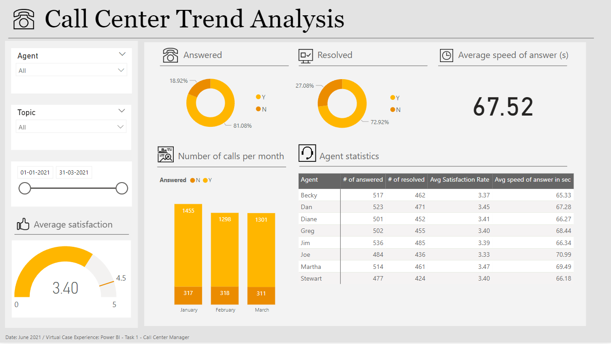
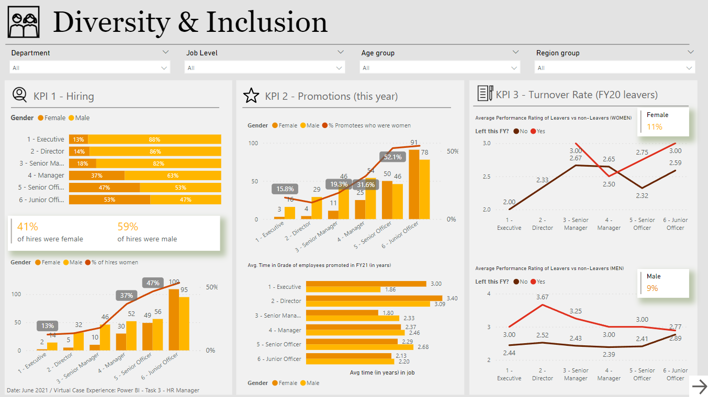

# PWC-Internship
This repository contains the tasks that has been performed during my Virtual Internship in PWC

## TASK 1 Call Center Trends Analysis
A telecom company needs to know about the transparency and insight into the data at the call centre and also provide an overview about long term trends in customer and agent behaviour.

## Solution
Creating a dashboard in POWERBI that shows the following KPI's

- Overall customer satisfaction
- Overall calls answered/abandoned
- Calls by time
- Average speed of answer
- Agent’s performance quadrant -> average handle time (talk duration) vs calls answered

Please refer to the Call Centre Trend Analysis.pbix file for the POWERBI dashboard.

## TASK 2 Customer Retention Dashboard
The telecom company's Retention Manager feels that the Customers in the telecom industry are hard-earned they don’t want to lose them. The retention department is planning to get customers back in case of termination .Currently, they get in touch after they have terminated the contract, but this is reactionary: it would be better to know in advance who is at risk. 
He would like to know more about their customers: visualised clearly so that it’s self-explanatory for our management to retain the customer.

## Solution
Creating a dashboard showing Customer Retention that incudes
- Customers who left within the last month
- Services each customer has signed up for: phone, multiple lines, internet, online security, online backup, device protection, tech support, and streaming TV and movies
- Customer account information: how long as a customer, contract, payment method, paperless billing, monthly charges, total charges and number of tickets opened in the categories administrative and technical
- Demographic info about customers – gender, age range, and if they have partners and dependents

Please refer to the Customer Retention.pbix file for the POWERBI dashboard.

## TASK 3 Diversity and Inclusion Dashboard
Human Resources at the  telecom client is highly into diversity and inclusion. They’ve been working hard to improve gender balance at the executive management level, but they’re not seeing any progress. 
Companies need a workforce of diverse talents and backgrounds to succeed in an increasingly complex and heterogeneous world. They aim for all of our teams to feel welcome and appreciated.

## Solution

Calculating the following measures could help to define proper KPIs and dive into deeper analysis on Diversity and Inclusion strategy:

- number of men
- number of women
- number of leavers
- % employees promoted (FY21)
- % of women promoted
- % of hires men
- % of hires women
- % turnover 
- Average performance rating: men
- Average Performance rating: women

Please refer to the Diversity and Inclusion.pbix file for the POWERBI dashboard.

